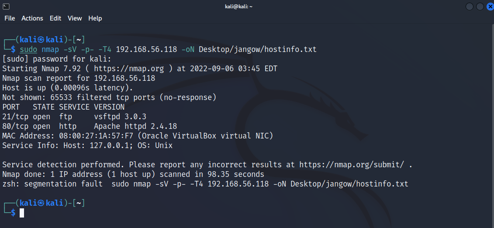
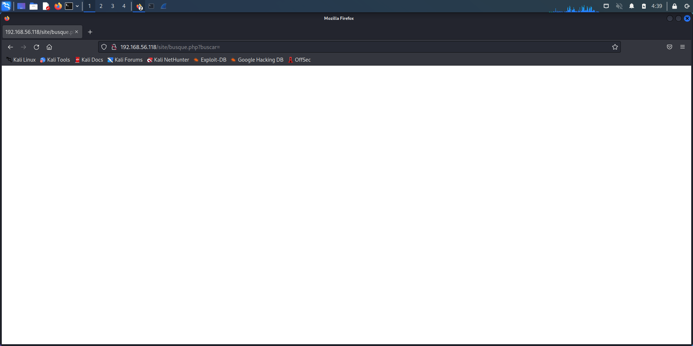
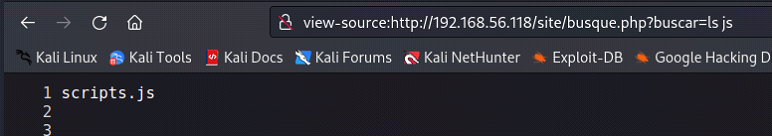
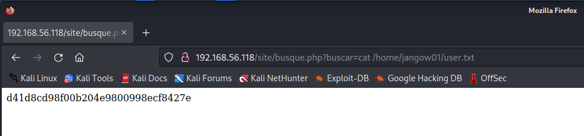
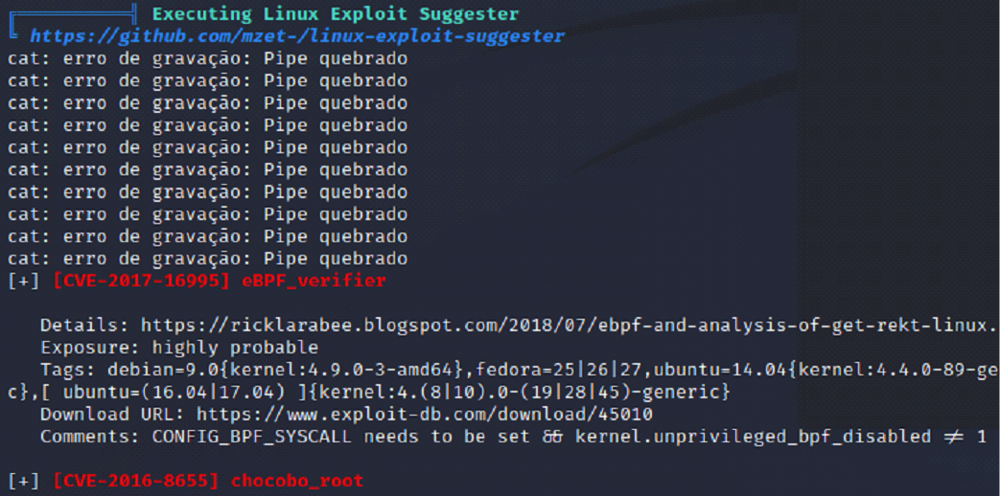
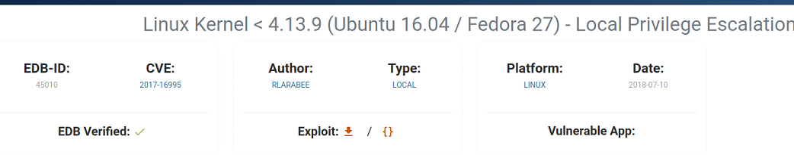

#  Jangow 01 Walkthrough

The goal of this penetration test is to enumerate the target, find notable vulnerabilities and
try to exploit them to gain root access to the machine. The target machine is Jangow01 from
VulnHub. 

## Target Enumeration

### Step 1: Scanning the host
The first step towards any penetration test is to enumerate the target and try to gather as much
information as possible. So, let's start nmap and scan the target ip address.

```
nmap -sV -p- -T4 192.168.56.118 -oN Desktop/jangow/hostinfo.txt
```


From the scan results above, we can see that only port 21 and port 80 is open along with their
version information. We can also note that the target is a Unix based machine. We note down our
findings by directly piping our nmap output to a .txt file using the -oN command.
Afterwards, we try to run an aggressive scan on the target machine by supplying the -A flag to
the nmap command which will run a whole bunch of scripts on the target. The goal of this step is to
check if we can extract more information.


```
nmap -A 192.168.56.118 -oN Desktop/jangow/hostEnum.txt
```
Unfortunately, we could not find the type of information that we were looking for. Therefore, the next step would be to enumerate the services.

---

### Step 2: Enumerating the FTP service
From the aggressive scan, we can see that the target does not have an option for anonymous login. Therefore, we do a search online to find related vulnerabilities.


We found a vulnerability associated with the version of Apache HTTPD running on the target. From further research, it seems like it’s a post exploitation script which might be useful to us later.

---

### Step 3: Enumerating the HTTP service
We visit the website on http://*TargetIP*. Upon visiting, we can see there is one directory named /site


We then proceed to the site and begin looking around by visiting and exploring the different pages this website has to offer.


Something interesting happens when we try to visit the 'Buscar' page



While visiting the buscar page, we notice there is nothing available to view. This poses the idea that the website is not complete from a development standpoint. By viewing the URL in the address bar, we can see something very interesting. The URL is pointing to the file busque.php file under the site folder. Right after the query string separator we can see the query string ‘buscar’ without any parameters assigned to it.


This misconfiguration raises suspicion of LFI. Therefore, we supply a parameter ‘ls’, to check whether the website is susceptible to [Local File Inclusion (LFI)](https://owasp.org/www-project-web-security-testing-guide/v42/4-Web_Application_Security_Testing/07-Input_Validation_Testing/11.1-Testing_for_Local_File_Inclusion). As an attacker, we can use Local File Inclusion (LFI) to trick the web application into exposing or running files on the web server. To test for LFI, we supply arbitrary terminal commands to elicit a response.


Based on the output above, our assumption is accurate about the webpage having LFI vulnerability. Therefore we can use command line injection to extract information. But first, we need to identify what system we are interacting with. This is not required since the previous 'ls' command did not give us an error, indicating it is a linux system. For identification, we can try known linux and windows commands for a response.

We now proceed to inspect the directories in the home folder of this webpage.

**First Directory:** assets


**Second File:** busque.php


**Third Directory:** css


**Fourth File:** scripts.js



**Fifth Directory:** wordpress


Inside the wordpress directory, we can see a config.php file.


Inside the wordpress/config.php file, we can see a username and password stored in plaintext. We keep a note of the username and password. This could be useful to us later.

    Username: desafio02
    Password: abygurl69

We carry on with our enumeration on the web server. By trying to enumerate from the root directory.


In the root directory we can see a list of all directories currently on the system at the root level. Therefore, we directly try to access the root user's home directory.


We cannot get access to the directory of the root user, meaning Apache does not have root permissions on the target system. So, we move to the /home directory




We have found the user flag under /home/jangow01 directory, in file ‘user.txt’

___

### Step 4: Further Enumeration

After finding the user flag, we carry on trying to find useful information about the system which will help us curate our attacks on the system.

**Finding the kernel version**

```
uname -a
```


**Finding the list of users available on the system**

```
cat /etc/passwd
```


**Checking hidden directories under /var/www/html**

```
ls -la /var/www/html
```


There is a .backup file which might have backup credentials. 

By viewing the contents of the file, we see very interesting information.


```
cat /var/www/html/.backup
```

We know from our earlier information that mysql is not running on the target machine. Perhaps it was running at one time and was removed. We keep a note of the username and password.

    Username: jangow01
    Password: abygurl69

**Checking if we can login to FTP using the username/password gathered so far**


Bingo! We can use jangow01:abygurl69 to login to the ftp service.

___
## Foothold
A reverse shell, also known as a remote shell or “connect-back shell,” takes advantage of the target system’s vulnerabilities to initiate a shell session and then access the victim’s computer. The goal is to connect to a remote computer and redirect the input and output connections of the target system’s shell so the attacker can access it remotely.

We will try different methods of gaining a reverse shell on the target machine.

### Method 1: Using php-reverse-shell.php
We do a search on google and download the code for a
[php reverse shell](https://github.com/pentestmonkey/php-reverse-shell).

**Step 1:** Copy the raw code of the php-reverse-shell

**Step 2:** Create a file on your local machine


**Step 3:** Paste in the copied code using CTRL+SHIFT+V

**Step 4:** Modify the listening $ip and $port information to that of our host IP address


**Step 5:** Upload the php-reverse-shell.php file to /var/www/html using ftp service


**FAILED!** Since the user does not have permission to write to the directory, we are unable to upload our php reverse shell code.

### Method 2: Using Netcat

**Step 1:** On Host terminal, 
```
nc 192.168.56.118 21
```

Here we are specifying the ftp port and the target ip address.

**Step 2:** We supply the username and password


**FAILED!** We are unable to get a reverse shell connection using Method 2.

### Method 3: Using Bash Shell Script
We search on the web for a reverse shell script: [Resource](https://pentestmonkey.net/cheat-sheet/shells/reverse-shell-cheat-sheet).


**Step 1:** Copy the bash script


**Step 2:** Modify the code, by using our host IP address and port


**Step 3:** Run the netcat listener on our host machine on the port specified in the bash script


**Step 4:** Paste the script on the website’s buscar page where we discovered the LFI vulnerability


When examining the URL bar during runtime, we can see that the bash script is automatically converted into a string by the server. 
Therefore we need to encode the bash script into a url string

**Step 5:** Encode the bash shell script into url string 
We can search online for base64 encoders. For this penetration test we will use the following [service](https://www.urlencoder.org/).


**Step 6:** Repeat step 4 using the encoded bash script command


After executing, netcat has received a connection

**Make the shell interactive:**

Run the following command:
```
python3 -c ‘import pty;pty.spawn(“/bin/bash”)’
```
```
export TERM=xterm
```

**Switch to jangow01 user**
```
su jangow01
```
```
Password: abygurl69
``` 


---
## Privilege Escalation

For privilege escalation we will use linPEAS, which automates local enumeration. This can help us identify vulnerabilities to escalate our privileges. 

**Step 1:** Search the web for linpeas: [Resource](
https://github.com/carlospolop/PEASS-ng/tree/master/linPEAS)

**Step 2:** Download the file from the release section


**Step 3:** After Downloading the file, transfer the file to the target system using FTP


**Step 4:** View the file on the target machine from the reverse shell


**Step 5:** Make it executable

```
chmod +x linpeas.sh
```

**Step 6:** Execute the script
```
./linpeas.sh
```

After running the script, we are greeted by a lot of exploits to which the target machine is susceptible to.



So, let's first try the eBPF_verifier vulnerability. 

**Step 7:** Search for the vulnerability on google and download the file



**Step 8:** Upload the file to the target machine using the FTP service to /home/jangow01

**Step 9:** Compile the code on the target machine using GCC compiler


```
gcc 45010.c -o exploit
```

Step 10: Run the exploit
```
./exploit
```


After running the execution, we can see that it has root privileges over the machine. We can now
proceed to extract the root flag


