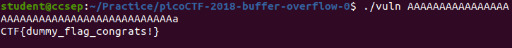

#  picoCTF 2018 - BufferOverflow 0

Binary Exploitation is a broad topic within Cyber Security that comes down to finding a vulnerability in a program and exploiting it to gain control of a shell or modify the program’s functions.


My approach to solving buffer overflow binary exploitation problems is to follow a three-step approach. Understand the code, understand the output, and finally manipulate the output. First, it is very important to pay attention to the source code. The main idea of secure programming is to pay attention to how you code. One mistake by a programmer can cause unforeseen damage. So, before we run the code in a sandboxed environment, we will inspect the code visually.

```c
#include <stdio.h>
#include <stdlib.h>
#include <string.h>
#include <signal.h>

#define FLAGSIZE_MAX 64

char flag[FLAGSIZE_MAX];

void sigsegv_handler(int sig) {
  fprintf(stderr, "%s\n", flag);
  fflush(stderr);
  exit(1);
}

void vuln(char *input){
  char buf[16];
  strcpy(buf, input);
}

int main(int argc, char **argv){
  
  FILE *f = fopen("flag.txt","r");
  if (f == NULL) {
    printf("Flag File is Missing. Problem is Misconfigured, please contact an Admin if you are running this on the shell server.\n");
    exit(0);
  }
  fgets(flag,FLAGSIZE_MAX,f);
  signal(SIGSEGV, sigsegv_handler);
  
  gid_t gid = getegid();
  setresgid(gid, gid, gid);
  
  if (argc > 1) {
    vuln(argv[1]);
    printf("Thanks! Received: %s", argv[1]);
  }
  else
    printf("This program takes 1 argument.\n");
  return 0;
}

```

---

## Analysis 
In the program we see *SIGSEGV*, also known as a [segmentation violation or segmentation fault](https://phoenixnap.com/kb/sigsegv#:~:text=Signal%2011%2C%20also%20known%20as,the%20program%20as%20a%20response.), is a signal used by Unix-based operating systems (such as Linux). It indicates an attempt by a program to write or read outside its allocated memory. Meaning, the program will output the flag by sending a signal that a segmentation fault has occurred. Therefore, we need to overflow the buffer until we start to overwrite the RIP register.

---

## Exploitation
We can simply supply a lot of arbitrary data in the command-line arguments to trigger an overflow.


